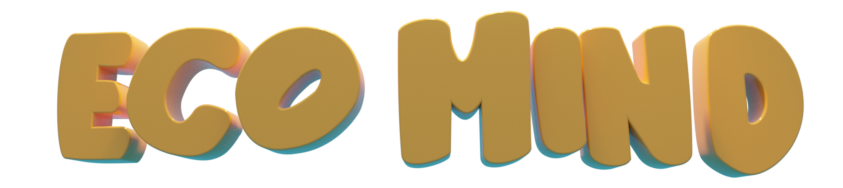
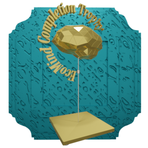
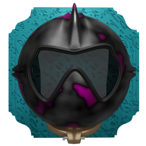
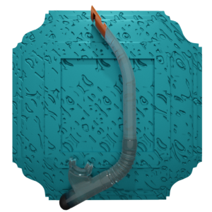
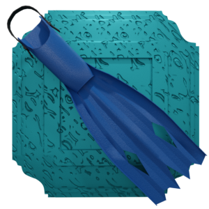
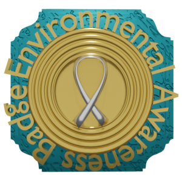
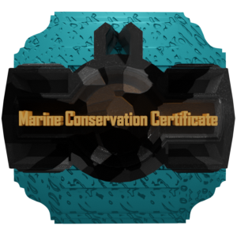

# EcoMind

## General description

Welcome to EcoMind, an underwater adventure designed to inspire environmental consciousness and ignite your passion for a greener future. Dive into the depths of the ocean and join the community of eco-warriors on a mission to save our precious marine ecosystem.

Equipped with your virtual diving gear, you'll embark on exciting expeditions to collect trash such as plastic bottles and cans that threaten the ocean. As time ticks away, you'll race against the clock to gather as much as possible to finish the mission. 

As you progress, you'll unlock new equipment and face new challenges. Each Eequipment locked is made of recycled plastic and cans that you are collecting from the water.

Ultimately, your goal in EcoMind is to complete all the missions and earn the prestigious EcoMind Trophy, symbolizing your readiness to make a lasting difference for a greener future and bring positive change to our planet.

## Team Member

- Samar Abi Khalil: MSc student for neuronal and cognitive systems at Université Côte d'Azur.

## Special Thanks

- Elie Ibrahim: 3D Artist and Animator who created all models, and helped with the UI/UX.
- Sassine Abi Khalil: Music Composer who created all music and sound effects.

## Controls
Mouse: Use the mouse to interact with the game's interface and navigate underwater.

## Missions

1. Mission 1: Recycled Mask
    - Time: 30 seconds
    - Objective: Collect 15 trash to obtain a recycled mask. The mask enhances your underwater visibility, allowing you to navigate through the ocean depths with clarity in other missions.
    - 

2. Mission 2: Recycled Snorkel
    - Time: 30 seconds
    - Objective: Collect 25 trash to obtain a recycled snorkel. The snorkel extends your underwater time in the next missions by conserving precious oxygen.
    - 

3. Mission 3: Recycled Fins
    - Time: 50 seconds
    - Objective: Collect 35 trash to obtain recycled fins. The fins increase your swimming speed and agility.
    - 

4. Mission 4: Environmental Awareness Badge
    - Time: 50 seconds
    - Objective: Collect 45 trash to obtain the Environmental Awareness Badge. This badge signifies your commitment to sustainable practices and serves as a reminder of your pivotal role in raising awareness about the environmental challenges we face.
    - 

5. Mission 5: Marine Conservation Certificate
    - Time: 60 seconds
    - Objective: Collect 50 trash to obtain the Marine Conservation Certificate. This prestigious certificate acknowledges your expertise in marine conservation and recognizes your contributions towards a cleaner and healthier ocean ecosystem.
    - 

6. Mission 6: EcoMind Completion Certificate
    - Time: 60 seconds
    - Objective: Collect 60 trash to obtain the EcoMind Completion Certificate. With the EcoMind Certificate, you possess the tools and inspiration to create a sustainable future for our planet.
    - 

## Video Link

[Link to be released soon](video_link)

## Play the Game

To be released soon

## Installation

1. Download the code and open `index.html` in your preferred web browser.

   or

2. If you prefer to run the game on a local server, or having issues with CORS, follow these steps:
    - Open a terminal and navigate to the game's directory.
    - Run the command: `python -m http.server`
    - Open your web browser and visit `http://localhost:8000`

## Documentation

For more detailed information about the game and its features, please refer to the [documentation.md](documentation.md)
